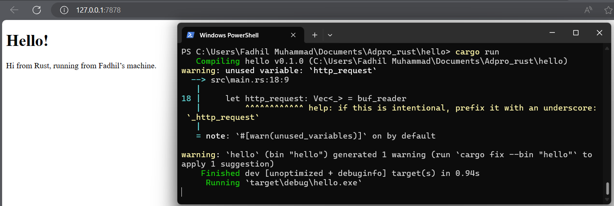
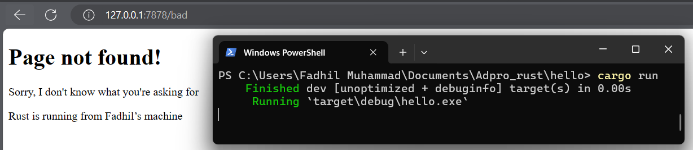

```
Fadhil Muhammad
2206083464
```
# Module 6 Tutorial: Rust Server

## Commit 1: What is inside the `handle_connection` method.
```rust
...
fn handle_connection(mut stream: TcpStream) { 
    let buf_reader = BufReader::new(&mut stream); 
    let http_request: Vec<_> = buf_reader 
        .lines() 
        .map(|result| result.unwrap()) 
        .take_while(|line| !line.is_empty()) 
        .collect(); 
 
    println!("Request: {:#?}", http_request); 
} 
...
```

Fungsi `handle_connection` dalam kode tersebut bertugas untuk menangani koneksi TCP yang diterima dari client dengan menggunakan `BufReader` untuk membaca data baris per baris, kemudian memproses setiap baris untuk mengumpulkan request HTTP dalam vektor `http_request`, dan kemudian mencetaknya ke konsol/terminal untuk melihat struktur HTTP request yang diterima.

Proses dimulai dengan mengikat server TCP pada alamat dan port tertentu agar dapat mendengar koneksi yang masuk dari client. Saat koneksi baru diterima, server menerima `TcpStream` yang mewakili koneksi tersebut dan meneruskannya ke fungsi `handle_connection()`. Di dalam fungsi ini, koneksi TCP dibaca baris per baris menggunakan `BufReader`, dengan setiap baris diproses untuk membentuk permintaan HTTP yang kemudian disimpan dalam vektor `http_request`. Setelah semua baris permintaan terkumpul, informasi permintaan HTTP tersebut dicetak ke konsol.

## Commit 2: Returning HTML

 

Kode `handle_connection` telah dimodifikasi. Setelah membaca permintaan HTTP dari client menggunakan `BufReader` dan mengumpulkannya dalam vektor `http_request` seperti sebelumnya, kode sekarang membangun respons HTTP yang mencakup status line, header `Content-Length`, dan isi konten dari file "hello.html". Ini dilakukan dengan menggunakan `fs::read_to_string` untuk membaca isi file "hello.html" ke dalam string `contents`, dan kemudian menghitung panjangnya untuk header `Content-Length`. Setelah itu, kode membangun respons dengan format yang sesuai dengan protokol HTTP, yang mencakup status line, header `Content-Length`, dan isi konten. Respons ini kemudian ditransmisikan kembali ke client melalui koneksi TCP menggunakan `stream.write_all()`. 

Modul fs ditambahkan untuk mengakses sistem file dalam library standar. Salah satu penggunaannya adalah untuk mengonversi konten dari sebuah file menjadi String. Macro format! digunakan untuk menambahkan konten file ke dalam body respons sukses. Untuk memastikan respons HTTP yang valid, header Content-Length ditambahkan yang diatur sesuai dengan ukuran dari tubuh respons. Saat ini, data permintaan dalam http_request diabaikan, sehingga hello.html dikirim tanpa syarat. Karena itu, Rust menampilkan peringatan ini saat kompilasi:

## Commit 3: Validating request and selectively responding


```rust
fn handle_connection(mut stream: TcpStream) { 
    ...
    let request_line = buf_reader.lines().next().unwrap().unwrap();
 
    let (status_line, filename) = if request_line == "GET / HTTP/1.1" {
        ("HTTP/1.1 200 OK", "index.html")
    } else {
        ("HTTP/1.1 404 NOT FOUND", "404.html")
    };
    ...
}
```
Dalam fungsi `handle_connection` yang telah diubah, pembacaan data permintaan HTTP dari client dilakukan secara berbeda. Sekarang, hanya baris pertama dari permintaan yang dibaca menggunakan `buf_reader.lines().next().unwrap().unwrap()`, yang menyimpannya dalam variabel `request_line`. Berdasarkan isi dari baris permintaan ini, digunakan untuk menentukan status line dan nama file yang akan dikirimkan sebagai respons. Jika baris permintaan sesuai dengan "GET / HTTP/1.1", maka status line akan diatur ke "HTTP/1.1 200 OK" dan nama file menjadi "index.html". Namun, jika tidak sesuai, maka status line akan diatur ke "HTTP/1.1 404 NOT FOUND" dan nama file menjadi "404.html". Selanjutnya, konten dari file yang sesuai dengan nama file tersebut dibaca menggunakan `fs::read_to_string(filename)` dan dimasukkan ke dalam variabel `contents`. Panjang konten ini dihitung untuk header `Content-Length`. Terakhir, respons HTTP yang dibangun sesuai dengan format yang sesuai dengan protokol HTTP, dengan menyertakan status line, header `Content-Length`, dan isi konten. Respons ini kemudian dikirimkan kembali ke client melalui koneksi TCP menggunakan `stream.write_all()`.